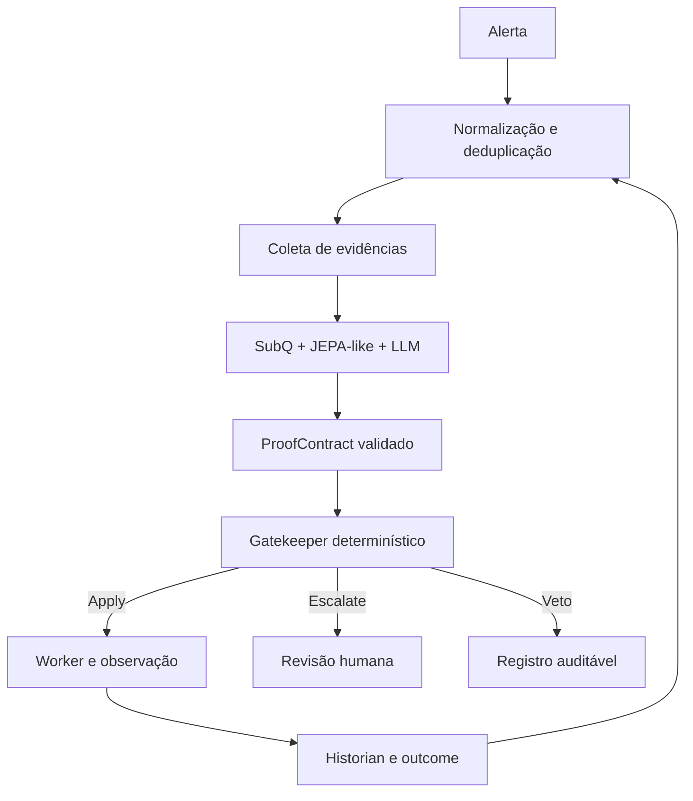

# Paulo Lab SRE Orchestrator

Sistema de auto-remediação para Kubernetes orientado por **dúvida**, memória histórica e gatekeeping determinístico. O objetivo é buscar reduzir o custo computacional e o risco de ações operacionais inseguras na infraestrutura, com benefícios sujeitos à validação experimental rigorosa. [docs.wandb](https://docs.wandb.ai/weave)

---

## Visão Geral da Arquitetura (Hypothesis & Closed-Loop)

O Paulo Lab SRE investiga se uma arquitetura composta por compreensão contextual de longo alcance (**SubQ**), predição de estados condicionada à ação (**JEPA-like**), explicação auditável por **LLM** e controle executivo determinístico (**Gatekeeper**) pode melhorar o diagnóstico e a antecipação de consequências operacionais sem ampliar de forma inaceitável o risco, o custo ou o tempo de recuperação.

O pipeline opera em malha fechada (*closed-loop*):



### Divisão de Responsabilidades
- **Normalização e Deduplicação**: Centraliza e descarta alertas redundantes no banco de dados.
- **Coleta de Evidências**: Consolida logs, traces e telemetria temporal de forma determinística.
- **SubQ + JEPA-like + LLM (Cognição)**: Os modelos analisam o contexto, prevêem estados futuros e geram explicações. Eles apenas **propõem e explicam**.
- **ProofContract**: Transporta de forma estruturada as evidências coletadas e as incertezas operacionais estimadas.
- **Gatekeeper (Executivo)**: Exerce o **controle executivo determinístico** do orquestrador (vetando ou autorizando ações).
- **Worker**: Executa somente as ações explicitamente autorizadas.
- **Historian**: Coleta telemetria pós-aplicação e rotula os desfechos, mas **não declara sucesso sem evidência suficiente**.

---

## Tabela de Maturidade do Paulo Lab SRE

| Componente | Estado Atual | Descrição / Detalhes |
| :--- | :--- | :--- |
| **Gatekeeper e playbooks** | Implementado experimentalmente | Regras de sandboxing e validação sintática ativas no orquestrador básico. |
| **ProofContract** | Implementado parcialmente | Schema Pydantic estruturado; preenchimento dinâmico inicial em andamento. |
| **Replay de incidentes** | Em desenvolvimento | Configuração inicial de testes com massa estática de regressão. |
| **Baseline RAG + regras** | Planejado | Integração de banco de vetores básico e classificadores determinísticos para baseline. |
| **Integração SubQ** | Hipótese experimental | Conceito de raciocínio lógico em dossiês completos pendente de modelagem. |
| **Predictor JEPA-like** | Hipótese experimental | Modelo preditivo condicionado à ação sem treinamento ou arquitetura ativos. |
| **Autonomia produtiva** | Não autorizada | O sistema opera estritamente sob supervisão ou em modo shadow offline. |

---

## Modos de Execução

O orquestrador suporta três modos definidos por `EXECUTION_MODE`:

| Modo | Objetivo | Comportamento |
|---|---|---|
| `offline` | Desenvolvimento e testes locais | Simula `kubectl`, usa classificador local no Historiador, desabilita ou roda W&B em modo offline. |
| `staging` | Validação conectada, sem ação destrutiva | Usa `kubectl apply --dry-run=server`, Historian em modo `log-only`, W&B/Weave habilitados. |
| `production` | Operação real no cluster | Executa ações reais, usa memória histórica para vetos e mantém instrumentação completa. |

Além disso, `ORCHESTRATOR_ENABLED=false` atua como kill-switch global. Quando desligado, o Worker e o Historiador pausam o processamento sem perder o estado da fila.

---

## Fluxo de Decisão Detalhado

### 1. Entrada e normalização
O webhook recebe alertas de fontes externas (Alertmanager, Datadog). Cada payload é normalizado para um contrato comum com campos mínimos:
- `source`
- `incident_id`
- `fingerprint_inputs`
- `proposed_action`
- `manifest_ref`
- `raw_payload`

O sistema calcula fingerprints no recebimento. Em caso de alertas repetidos, ele reabre o incidente de forma idempotente apenas se a severidade/versão do alerta for maior ou se o incidente anterior já foi aplicado mas voltou a ocorrer. Caso contrário, duplicatas ativas são descartadas.

### 2. Plano Cognitivo & Predição
O estado latente do incidente e as telemetrias coletadas são repassados ao modelo preditivo JEPA-like e ao SubQ:
- **Modelo JEPA-like**: Prevê o estado operacional futuro condicionado à ação de remediação escolhida, ao tempo decorrido ($\Delta$) e à incerteza:
  $$P_\theta(z_{t+\Delta} \mid z_t, a_t, \Delta) \rightarrow (\widehat{z}_{t+\Delta}, u_{t+\Delta})$$
  O modelo estima o estado futuro predito ($\widehat{z}_{t+\Delta}$) e um intervalo de incerteza ($u_{t+\Delta}$). Se a incerteza calculada ultrapassar limites pré-estabelecidos, a saída gerada deve ser classificada como `inconclusive` ou `escalate`.
- **LLM**: Traduz a hipótese em justificativas legíveis por humanos e consolida as informações no `ProofContract`.

### 3. Gatekeeper Determinístico
O Gatekeeper aplica regras determinísticas rígidas baseadas no contrato:
- `confidence < CONFIDENCE_THRESHOLD` $\rightarrow$ `needs_review` (revisão humana).
- Estratégia com falha recente para mesmo fingerprint $\rightarrow$ `vetoed` (veto).
- Modificação de recursos proibidos (Secrets, RBAC, StorageClasses, CRDs) $\rightarrow$ `vetoed`.
- Parâmetro fora da expressão regular autorizada ou namespaces não autorizados $\rightarrow$ `vetoed`.
- Caso contrário $\rightarrow$ `approved` (APPLY).

### 4. Execução e Leases Transacionais
O Worker consome a fila de trabalho. Para evitar concorrência entre workers no cluster, o sistema executa um lease transacional:
- **SQLite**: Usa `BEGIN IMMEDIATE` para locks atômicos.
- **Postgres**: Usa `FOR UPDATE SKIP LOCKED` para concorrência de múltiplos workers.

### 5. Historiador Tardio
Após a janela de observação, o Historiador analisa a telemetria do cluster e classifica o resultado final em:
- `resolved`: Sucesso comprovado por métricas claras de telemetria dentro da janela pós-aplicação.
- `reoccurred`: O incidente voltou a se manifestar no período de observação imediato.
- `caused_side_effect`: A remediação gerou novos problemas colaterais detectados por telemetria.
- `inconclusive`: Ausência de dados ou telemetria pós-aplicação insuficiente. **Impede que o incidente seja computado como sucesso.**

---

## Esquema de Dados

### `pending_incidents` (Fila transacional)
Fila de processamento concorrente.
- `incident_id`
- `source`
- `namespace`
- `pod_name`
- `proposed_action`
- `manifest_path`
- `status` (pending, applied, classified, vetoed, escalated, failed, needs_review)
- `retry_count`
- `ts_applied`
- `created_at`
- `error_message`
- `fingerprint` (com índice único parcial para garantir que apenas um incidente esteja ativo por fingerprint ao mesmo tempo)

### `incident_history` (Memória histórica auditável)
- `id`
- `fingerprint`
- `action_type`
- `outcome` (resolved, reoccurred, caused_side_effect, inconclusive)
- `proof_contract_json`
- `decision_reason`
- `applied_at`
- `classified_at`
- `historian_model`
- `trace_id`
- `run_id`

---

## Metodologia de Experimentos

Os experimentos científicos seguem os seguintes controles comuns:
1.  **Controle de Modelos**: Mesmo modelo-base (LLM) entre as variantes analisadas.
2.  **Controle de Recursos**: Mesmo orçamento máximo de tokens, latência de execução e custo.
3.  **Controle de Splits**: Divisão rigorosa temporal de treino, validação e teste para evitar vazamentos de dados.
4.  **Avaliação Cega**: O resultado real esperado não é revelado aos modelos antes ou durante o processo de inferência.
5.  **Acurácia Seletiva**: Monitoramento de taxas de abstenção (quando o modelo prefere responder `inconclusive` em vez de errar).
6.  **Fidelidade das Evidências**: Cada diagnóstico do modelo deve obrigatoriamente apontar para os trechos exatos de logs ou traces que o sustentam.

### Experimentos Planejados
- **Experimento 1 — SubQ versus RAG (Contexto)**: Avalia se raciocínio integral de dossiês complexos identifica causas distribuídas melhor do que a recuperação fragmentada por RAG.
- **Experimento 2 — JEPA-like versus Regras (Predição)**: Avalia se a predição de estado condicionado identifica efeitos colaterais melhor do que strings/thresholds estáticos.
- **Experimento 3 — Governança (Gatekeeper)**: Avalia o balanço entre redução de ações inseguras, MTTR, intervenção humana e taxa de vetos falsos (*false veto rate*).
- **Experimento 4 — Integração e Ablação**: Compara a eficácia da combinação total contra variantes parciais (Variantes A, B, C, D e E).

---

## Segurança e Governança

- **Segurança de Segredos**: O webhook token não pode possuir valores padrão (`dev-secret` ou `prod-secret-token-change-me`) em produção, e é injetado via secret do Kubernetes (`secretKeyRef`).
- **RBAC**: Permissões de leitura e escrita restritas. Removido qualquer acesso a Secrets ou manipulação de papéis de autorização por RBAC da ServiceAccount do Worker.
- **Isolamento de Pods**: Deployments separados para API (com `automountServiceAccountToken: false` e sem permissões adicionais) e Worker.
- **SecurityContext**: Ambos os pods rodam como não-root, filesystem somente leitura, drop total de capabilities e seccomp padrão.

---

## Testes e Validação CI/CD

### Executando Testes Locais
```bash
python -m pytest tests/
```

### Pipeline de CI/CD (.github/workflows/eval.yml)
A cada PR ou commit na branch `main`, a pipeline bloqueante do GitHub executa:
1.  **Secret Scanning**: Escaneamento de segredos expostos usando TruffleHog.
2.  **Syntax & Compilation**: Executa `compileall` para certificar que não há erros de sintaxe Python.
3.  **Kubernetes Manifest Validation**: Valida sintaticamente todos os arquivos YAML do diretório `kubernetes/`.
4.  **Unit & Integration Tests**: Executa a suíte completa de testes locais via `pytest`.
5.  **Weave Evaluation**: Roda a validação de acurácia baseada em datasets de incidentes Weave se todas as etapas anteriores forem bem-sucedidas.
